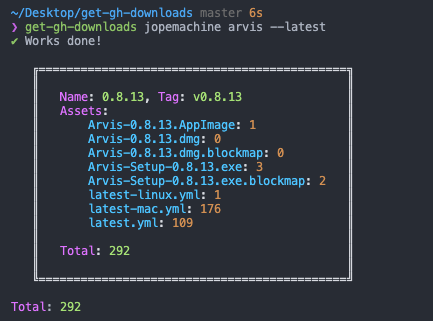

# get-github-release-download-count

[](http://badge.fury.io/js/get-github-release-download-count)
[](http://badge.fury.io/js/get-github-release-download-count)
[](https://lbesson.mit-license.org/)

Display github release download count in console (also include lib)



## Usage

```js
const getDownloadCount = require('get-github-release-download-count');

const data = getDownloadCount({
  userId,
  repository,
  tagName: 'v0.0.1'
});
```

## Usage-cli

```
  Usage

    $ get-github-release-download-count [user_id] [repository_name] name_option tag_option

  Example:

    $ get-github-release-download-count jopemachine some-lib --tag=v0.0.1

  ✔ Works done!

    ╔════════════════════════════════════════════╗
    ║                                            ║
    ║   Name: 0.0.1, Tag: v0.0.1                 ║
    ║   Assets:                                  ║
    ║       some_file.app: 1                     ║
    ║                                            ║
    ║   Total: 1                                 ║
    ║                                            ║
    ╚════════════════════════════════════════════╝

  Total: 1
```
